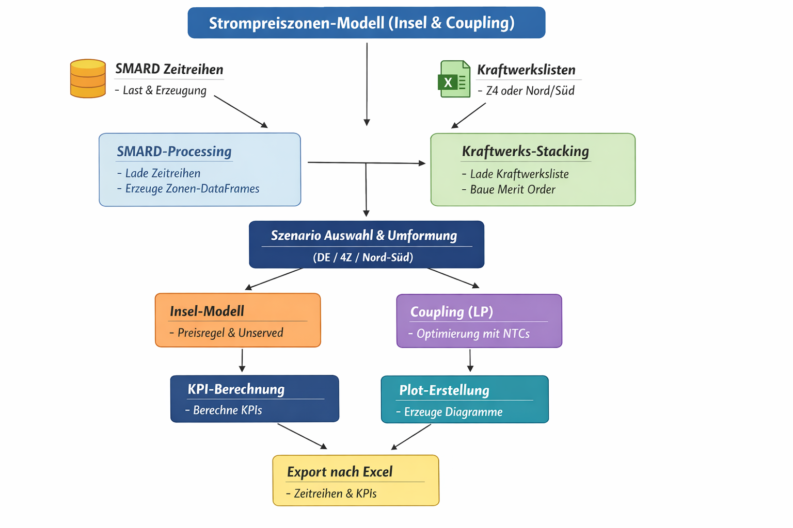

# Strompreiszonen-Modell (ÜNB / Nord–Süd) – Insel & Market Coupling

Dieses Projekt modelliert **Mengen** (Last, EE, konv. Erzeugung, Abregelung, Unserved) und **Preise** in unterschiedlichen **Zonenszenarien**:

- **DE_SINGLE**: Deutschland als **eine** Preiszone (ein Preis)
- **Z4_INSEL / Z4_COUPLED**: Deutschland als **4 ÜNB-Zonen** (50Hertz, TenneT, Amprion, TransnetBW)
- **NS_INSEL / NS_COUPLED**: Deutschland als **Nord/Süd**-Zonen (inkl. TenneT-Split per Faktoren)

Jeweils als:
- **INSEL**: keine Handelsmöglichkeiten zwischen Zonen
- **COUPLED**: Handel über **NTCs** per **Market Coupling (LP)**

---

## Architektur-Übersicht (Diagramm)

Lege die Datei `A_flowchart_diagram_illustrates_the_architecture_o.png` in denselben Ordner wie diese README.
Dann wird sie automatisch angezeigt:



---

## Empfohlene Ordnerstruktur

```
Projekt/
│
├─ src/                       # Python-Quellcode
│   ├─ main.py                # Startpunkt (Szenario auswählen, rechnen, exportieren, plots)
│   ├─ config.py              # Alle Einstellungen (Dateipfade, Parameter, Szenario)
│   ├─ io_smard.py            # SMARD Excel einlesen + Zeitreihen bauen
│   ├─ plants.py              # Kraftwerksliste einlesen + Stack/merit order bauen
│   ├─ island.py              # Inselmodell (MO-Preisregel + Unserved)
│   ├─ coupling.py            # LP (Market Coupling) mit NTCs (scipy)
│   ├─ scenarios.py           # DE / 4Z / NS Umformungen + NTC-Edges bauen
│   ├─ kpi.py                 # KPI-Berechnung
│   ├─ export_excel.py        # Excel-Export (tz entfernen)
│   └─ plots.py               # Plots (Insel + Coupled, Heatmaps, Vergleiche)
│
├─ data/                      # Eingabedaten
│   ├─ smard/                 # SMARD-Excel-Dateien (Last & Erzeugung)
│   ├─ plants/                # Kraftwerkslisten (4Z & Nord/Süd)
│   └─ ...                    # optional weitere Eingaben
│
└─ output/
    ├─ excels/                # erzeugte Excel-Dateien
    └─ figures/               # optional: gespeicherte Plots
```

**Wichtig:** In `config.py` werden alle Pfade so gesetzt, dass sie auf `data/…` zeigen und nach `output/…` exportiert wird.

---

## Voraussetzungen / Installation

### Python-Pakete
- `pandas`
- `numpy`
- `openpyxl`
- `matplotlib`
- **für Coupled (LP)**: `scipy`

Installation (Terminal / Anaconda Prompt):

```bash
pip install pandas numpy openpyxl matplotlib scipy
```

---

## Start in Spyder (oder Terminal)

### Spyder
1. `src/main.py` öffnen
2. Run drücken oder in der Console:

```python
%runfile "src/main.py" --wdir
```

### Terminal
Im Projektordner:

```bash
python src/main.py
```

---

## Konfiguration (src/config.py)

In `config.py` steuerst du:
- Szenario
- Zeitauflösung (15min oder h)
- Eingabepfade (SMARD & Kraftwerkslisten)
- Preislogik (Scarcity / NaN)
- NTCs & Handelskosten
- Plots an/aus

### Szenario auswählen
```python
SCENARIO = "DE_SINGLE"
```

Erlaubte Werte:
- `DE_SINGLE`
- `Z4_INSEL`
- `Z4_COUPLED`
- `NS_INSEL`
- `NS_COUPLED`

### Zeitauflösung
```python
TIME_FREQ = "15min"   # oder "h"
```

### Plots
```python
MAKE_PLOTS = True
```

### Preisschalter
```python
SCARCITY_PRICING_IN_PRICE = False
PRICE_NAN_WHEN_NO_CONV = True
VOLL = 10000.0
```

**Interpretation:**
- `SCARCITY_PRICING_IN_PRICE=True`  
  → Wenn `Unserved > 0`, wird der Preis **auf VOLL** gesetzt (Knappheit sichtbar).
- `PRICE_NAN_WHEN_NO_CONV=True`  
  → Wenn **keine konventionelle Erzeugung** läuft (nur EE), wird Preis = **NaN**  
  (hilfreich für Vergleich von Mittelwerten, weil „Nullpreise“ nicht alles herunterziehen).

---

## Daten: Was muss wo liegen?

### SMARD-Excel-Dateien (4 ÜNB)
Pro ÜNB werden zwei SMARD-Exports benötigt (Viertelstunde):
- **Realisierter Stromverbrauch** (Last)
- **Realisierte Erzeugung** (nach Technologien)

Diese Pfade sind in `config.py` unter `ZONES_4` hinterlegt.

### Kraftwerksliste 4Z (ÜNB)
- Datei: z.B. `Kraftwerksliste_Regelzonen.xlsx`
- Spalte für Zone: typischerweise `ÜNB`

### Kraftwerksliste Nord/Süd
- Datei: z.B. `Kraftwerksliste_Sued_Nord.xlsx`
- Spalte muss Nord/Süd enthalten (z.B. `Nord/Süd`, `Zone`, …)

**Hinweis:** Wenn in der Datei Werte wie `Süd`/`Nord` stehen, sollte im Code ein Mapping
auf `SUED`/`NORD` erfolgen (damit Filter robust laufen).

---

## Fachliche Logik (detailliert)

### 1) Zeitreihen je Zone aus SMARD (io_smard.py)

Aus SMARD wird pro Zeitschritt gebaut:

- `load_mw` : Last in MW  
- `vre_mw`  : EE-Summe in MW (aus definierten Technologien `EE_NEEDLES`)
- `residual_raw_mw = load_mw - vre_mw`
- `abregelung_mw   = max(vre_mw - load_mw, 0)`
- `konv_bedarf_mw  = max(load_mw - vre_mw, 0)`

**Einheiten:**
- SMARD Viertelstunde: **MWh pro 15 min**
- Umrechnung auf MW: `* 4`
- Bei Resampling auf `"h"`: MW werden gemittelt (Leistung).

Zusätzlich wird `dt_hours` berechnet (0.25 bei 15min, 1.0 bei h) und daraus:
- `load_mwh = load_mw * dt_hours`
- `vre_mwh`, `konv_mwh`, `abregel_mwh` analog.

---

### 2) Kraftwerks-Stack (plants.py)

Aus der Kraftwerksliste wird pro Modellzone ein Angebotsstack gebaut:

- `cap_mw` aus Kapazitätsspalten (je nach `CAP_MODE`)
- `mc` (Grenzkosten) aus `"Grenzkosten [EUR/MWHel]"`

**Wichtige Modellentscheidung:**
- Anlagen **ohne mc** werden **nicht** genutzt.
  Sie werden aber als Check exportiert (`plants_no_mc`, `missing_mc_cap`).

---

### 3) Inselmodell (island.py)

Pro Zone:
- Konv. Bedarf `konv_bedarf_mw` wird gegen die nutzbare Kapazität gestellt:
  - `abgedeckt_mw = min(konv_bedarf_mw, cap_effective)`
  - `unserved_mw  = max(konv_bedarf_mw - cap_effective, 0)`

Preisbildung (Heuristik / Merit Order):
- Wenn konv. Bedarf innerhalb MO-Kapazität liegt → marginale `mc`
- Sonst ggf. Reserve-Fallback (je nach Konfig)

Optional (Schalter):
- Knappheitspreis im Preisreport (`SCARCITY_PRICING_IN_PRICE`)
- NaN-Preis bei „nur EE“ (`PRICE_NAN_WHEN_NO_CONV`)

---

### 4) Market Coupling (coupling.py) – nur COUPLED

Pro Zeitschritt wird ein lineares Programm (LP) gelöst:

**Ziel:**
Minimiere
- konventionelle Kosten `mc * g`
- Handelskosten `trade_cost * flow`
- Unserved `VOLL * unserved`

**Nebenbedingungen pro Zone (Leistungsbilanz):**
`ee_used + conv_gen + imports - exports + unserved = load`

**NTC-Kanten:**
- Flüsse sind pro Kante `0 .. NTC`
- Kosten pro Kante (Multi-Hop zahlt mehrfach)

**Preisreporting:**
- `SCARCITY_PRICING_IN_PRICE=True`: Preis = Dualwert der Bilanz (Knappheit sichtbar)
- `False`: „MO-like“-Preis aus tatsächlichem Dispatch (Dualwerte werden optional mit exportiert)

---

## Output

### Excel (output/excels/)
Export enthält typischerweise:
- `kpi_zone_insel`
- `timeseries_insel`
- `ee_by_tech_mw`
- `plants_stack_*`, `plants_cap_*`, `plants_no_mc_*`
- bei Coupled zusätzlich:
  - `kpi_zone_coupled`
  - `timeseries_coupled`

### Plots (plots.py)
Wenn `MAKE_PLOTS=True`:
- Insel:
  - Tages-Max/Mean: konv. Bedarf vs Abdeckung vs Unserved
  - EE-Stack nach Technologie
  - Preis-Heatmap (Monat × Stunde)
- Coupled (falls vorhanden):
  - Preisvergleich Insel vs Coupled
  - Unserved/Curtailment Vergleich (MWh/Tag)
  - Nettoimport (MWh/Tag)
  - Coupled Preis-Heatmap
  - optional: DE load-gewichteter Preis (wenn mehrere Zonen)

---

## Typische Fehler & schnelle Lösungen

### Coupled-Plot crasht mit NoneType
- Ursache: `coupled` ist `None` (weil kein Coupled-Szenario)
- Lösung: Coupled-Plots nur ausführen, wenn `coupled is not None` (im aktuellen main.py enthalten)

### Nord/Süd: Süd hat cap=0
- Ursache: Zonenspalte/Werte matchen nicht (`Süd` vs `SUED`) oder falsche zone_col
- Lösung:
  - `NS_PLANTS_ZONE_COL` in config.py fest setzen
  - Mapping `Süd -> SUED`, `Nord -> NORD` vor dem Filtern

### openpyxl Warnung „no default style“
- Harmlos (SMARD-Export). Kann ignoriert werden.

---

## Ziel & Grenzen des Modells

Dieses Modell ist **kein Netz-/Redispatch-Modell**. Es ist ein:
- transparentes
- didaktisches
- reproduzierbares

**Strompreiszonen- und Marktmodell** für:
- Szenarienvergleiche (DE vs 4Z vs NS)
- Preis- und Mengenlogik verstehen
- KPI-Auswertungen (Curtailment, Unserved, Preisniveau)
